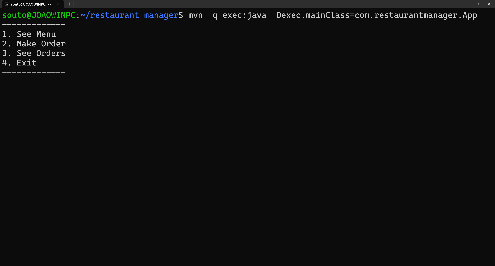
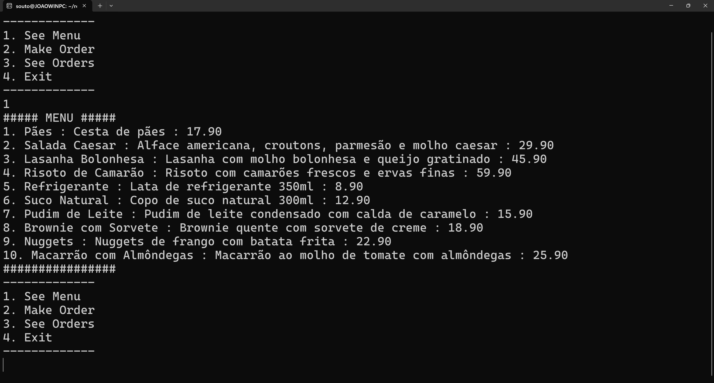
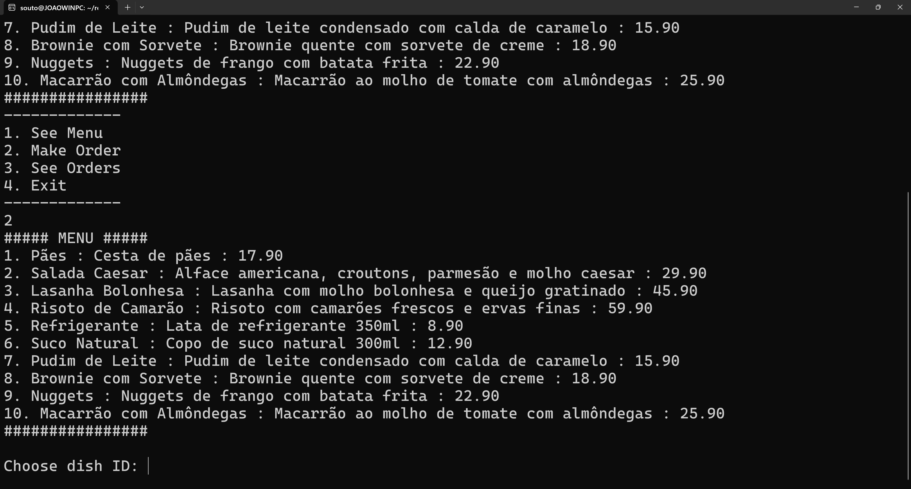
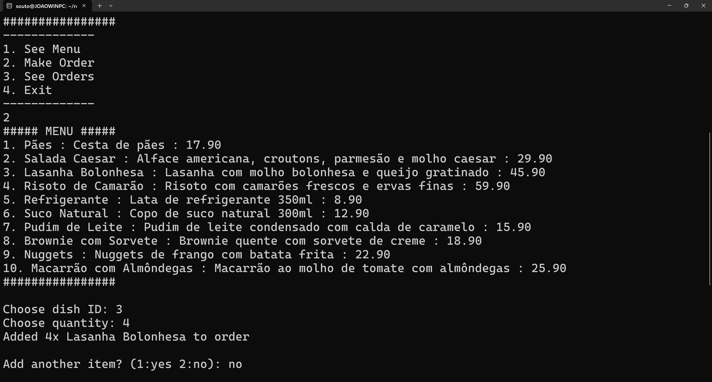
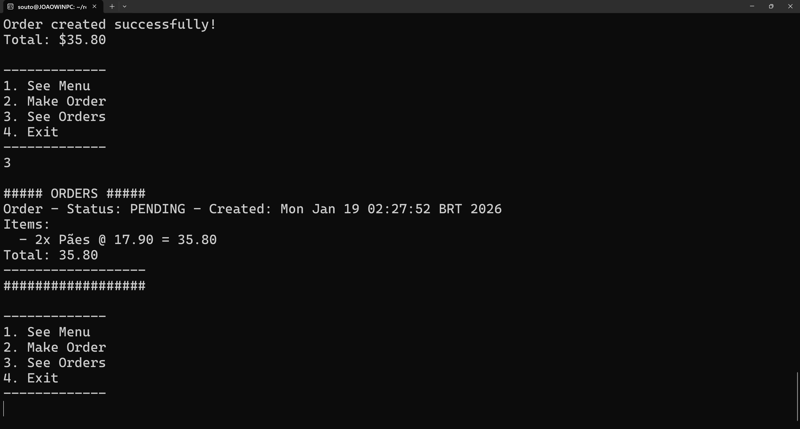

# restaurant-manager
Simple project to demonstrate knowledge in Java, Object-Oriented Programming, among other topics.

The project is a simple restaurant manager that allows users to create orders, add items to orders, view the menu, and see order details.


- MVC Architecture
- In-memory persistence
- CLI
- Simple unit tests

## Run project
```
mvn compile
mvn -q exec:java -Dexec.mainClass=com.restaurantmanager.App
```

## Run tests
```
mvn test
```

# Things learned
- Review of Java syntax, and OO good practices
- Final keyword, static keyword, @ symbol
- Abstraction
- Maven tool
- try catch exception handling
- Unit testing with JUnit

# Images




